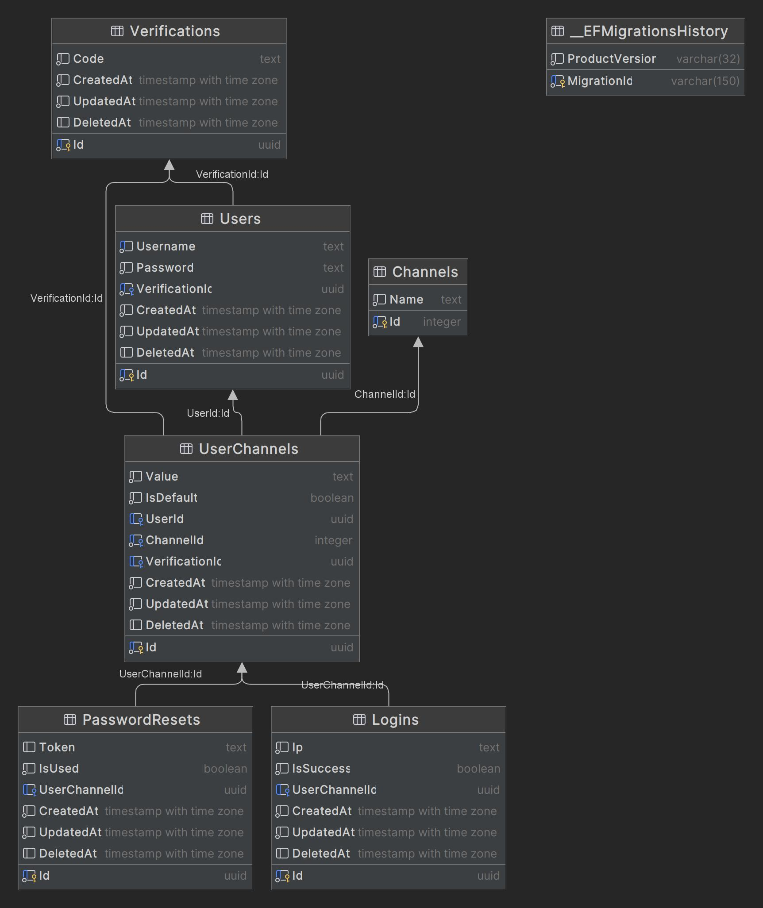

# Authentication Service

## Description

This service is a subset of the User Management System (UMS) that handles authentication functionalities.

## Features

- [x] Sign-up
- [ ] Sign-in
- [x] Verify
- [x] Set Credentials
- [x] Reset Password
- [ ] Reset Username

## Database

### Diagram

<details>
  <summary>Show</summary>


</details>

### Create Migrations and Database Update

```shell
dotnet tool install --global dotnet-ef
dotnet ef migrations add MigrationName
dotnet ef database update
```
